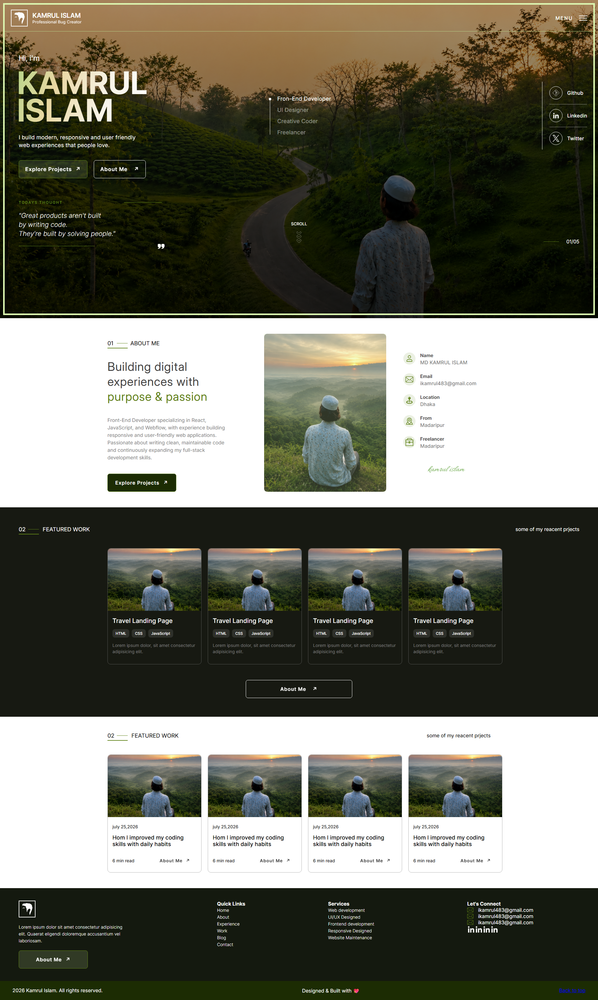

# 👨‍💻 Kamrul Islam — Personal Portfolio

> A modern and responsive personal portfolio website built with HTML5 and CSS3 to showcase my skills, projects, experience, services, and frontend development journey.


<table>
  <tr>
    <td>

## 📖 Overview

This is my personal portfolio website, designed to present my work and skills as a frontend developer.

The website focuses on a clean, minimal, and professional visual style while providing visitors with an overview of my background, featured projects, services, and contact information.

The project was built from scratch using **HTML5 and CSS3**, with a strong focus on responsive layouts, typography, spacing, visual hierarchy, and user experience.

---

## 🛠️ Technologies Used

### Frontend

- HTML5
- CSS3
- Responsive Web Design
- CSS Flexbox
- CSS Grid
- CSS Positioning
- CSS Transitions
- Custom Typography
- Semantic HTML

### Tools

- Git&nbsp; - GitHub&nbsp;  - VS Code&nbsp;  - GitHub Pages

      
  </td>
    <td>
 ## 📸 Website Preview

  <p align="center">
  
</p>
    </td>
  </tr>
</table>

---

## 🌐 Live Demo

🚀 **Live Website:**  
[Visit Portfolio](https://kamrulcode.github.io/portfolio/)

💻 **GitHub Repository:**  
[View Source Code](https://github.com/kamrulcode/portfolio)


---

## ✨ Main Features

- 🏠 Modern hero section
- 👨‍💻 Personal introduction
- 📋 About me section
- 💼 Featured projects section
- 📝 Blog / articles section
- 🛠️ Services section
- 🔗 Social media links
- 📱 Responsive design
- 🎨 Clean and minimal UI
- ✨ Modern typography and visual hierarchy
- 📧 Contact information
- 🦶 Responsive footer
- ⬆️ Back-to-top navigation


---

## 📱 Responsive Design

The website is designed to work across different screen sizes, including:

- 💻 Desktop
- 💻 Laptop
- 📱 Tablet
- 📱 Mobile

The layout uses CSS Flexbox, Grid, relative sizing, and responsive techniques to maintain a consistent experience across devices.

---

## 📂 Project Structure

```text
portfolio/
│
├── index.html
│
├── css/
│   └── style.css
│
├── images/
│   ├── profile.jpg
│   ├── projects/
│   └── ...
│
├── screenshot.png
│
└── README.md
